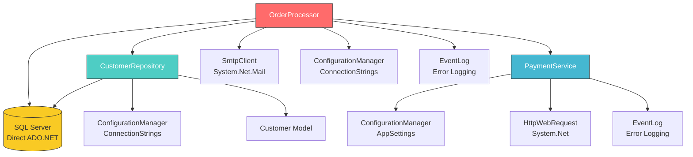

# Dependency Map — Contoso Order System

> Generated by Copilot CLI from all files in `@legacy-code/`

---

## Class Dependency Graph



## Dependency Summary Table

| Class | Depends On | Coupling Level | Notes |
|-------|-----------|---------------|-------|
| **OrderProcessor** | CustomerRepository, PaymentService, SqlConnection, SmtpClient, ConfigurationManager, EventLog | **HIGH** | Orchestrates everything; changes anywhere ripple here |
| **CustomerRepository** | SqlConnection, ConfigurationManager | **MEDIUM** | Clean data access, but no interface abstraction |
| **PaymentService** | HttpWebRequest, ConfigurationManager, EventLog | **MEDIUM** | Tightly coupled to QuickPay API format |
| **Customer** | *(none)* | **LOW** | Simple data model, no dependencies |

## Shared Dependencies (Hidden Coupling)

These shared dependencies mean changes in one place affect multiple classes:

| Shared Dependency | Used By | Risk |
|---|---|---|
| `ConfigurationManager` (connection string) | OrderProcessor, CustomerRepository | If the config key name changes, both break |
| `ConfigurationManager` (app settings) | OrderProcessor (SMTP), PaymentService (gateway) | 6 different config keys read across 2 files |
| `EventLog.WriteEntry` | OrderProcessor, PaymentService | Same log source "OrderSystem" in both — no structured logging |
| `System.Data.SqlClient` | OrderProcessor, CustomerRepository | Both open their own connections — no connection pooling strategy |

## What's Missing (Interface Gaps)

These classes communicate through **concrete types only** — no interfaces or abstractions exist:

```
OrderProcessor creates:
  → new CustomerRepository()    // hardcoded, no DI
  → new PaymentService()        // hardcoded, no DI
  → new SqlConnection(...)      // direct DB access alongside Repository
  → new SmtpClient(...)         // direct email sending
```

This means:
- **Unit testing is impossible** without hitting real databases and external APIs
- **Swapping implementations** (e.g., new payment provider) requires editing `OrderProcessor` directly
- **Mocking** any dependency requires refactoring to interfaces first

---

*This dependency analysis was generated by Copilot CLI. Cross-reference with your solution's actual project references and NuGet packages for completeness.*
