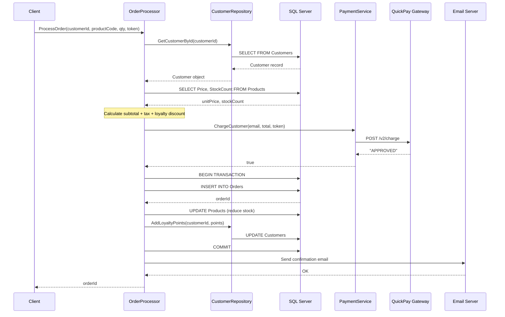
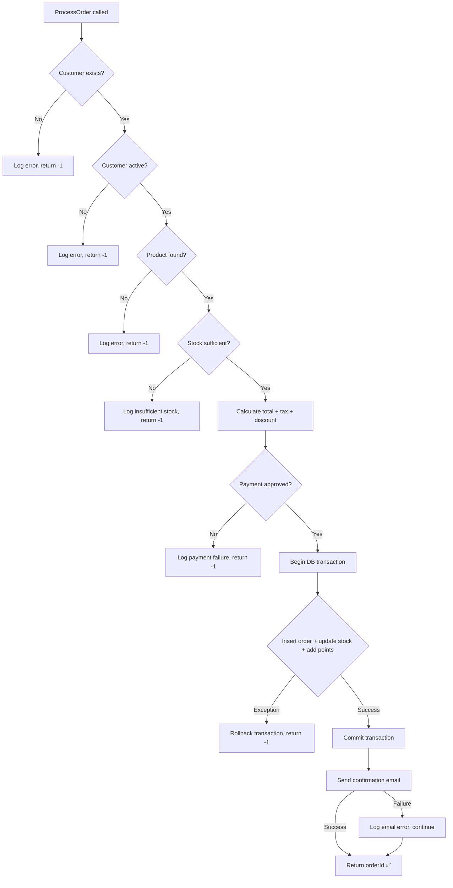
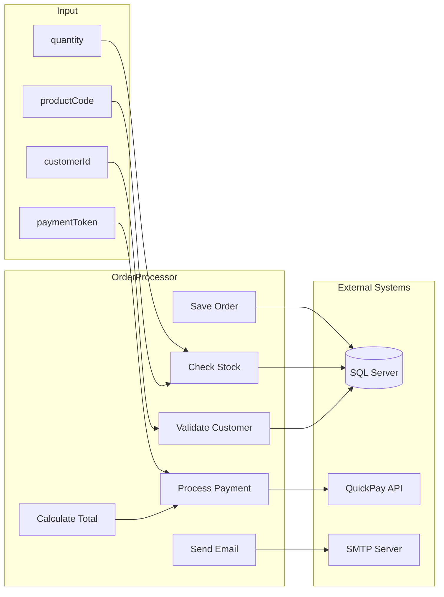

# OrderProcessor — Flow Diagram

> Generated by Copilot CLI from: `@legacy-code/OrderProcessor.cs`

---

## Happy-Path Sequence Diagram

## Failure-Path Flow Chart

## Data Flow Diagram

---

*These diagrams were generated by Copilot CLI. Paste into any Mermaid-compatible renderer (GitHub markdown, VS Code preview, Mermaid Live Editor) to visualize.*
